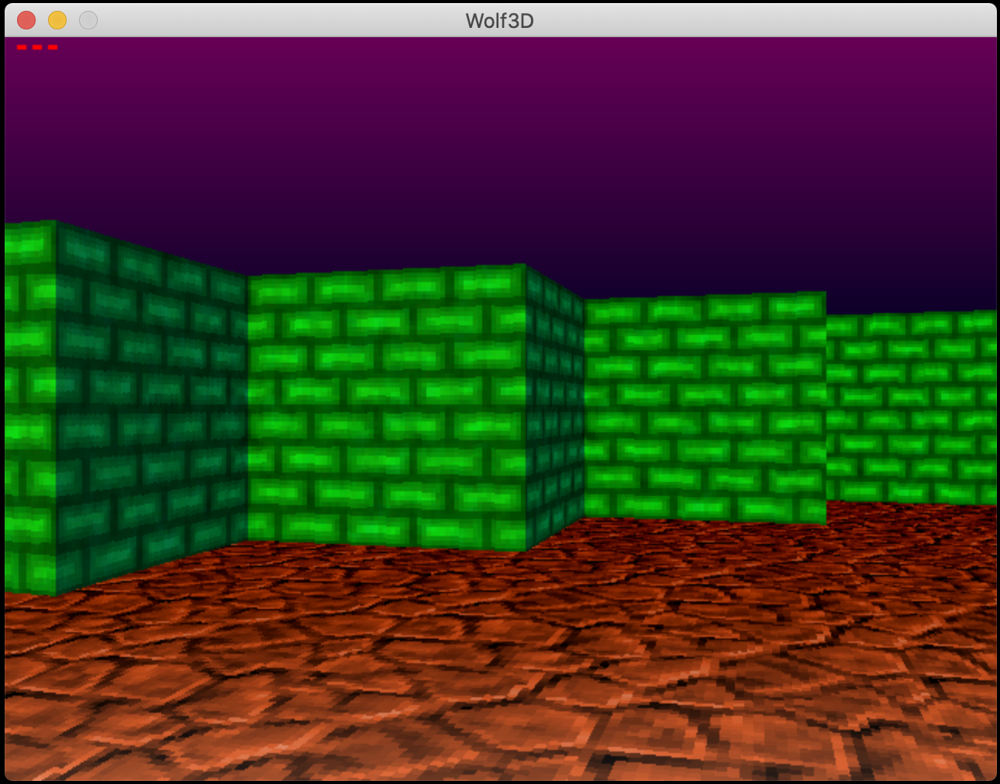
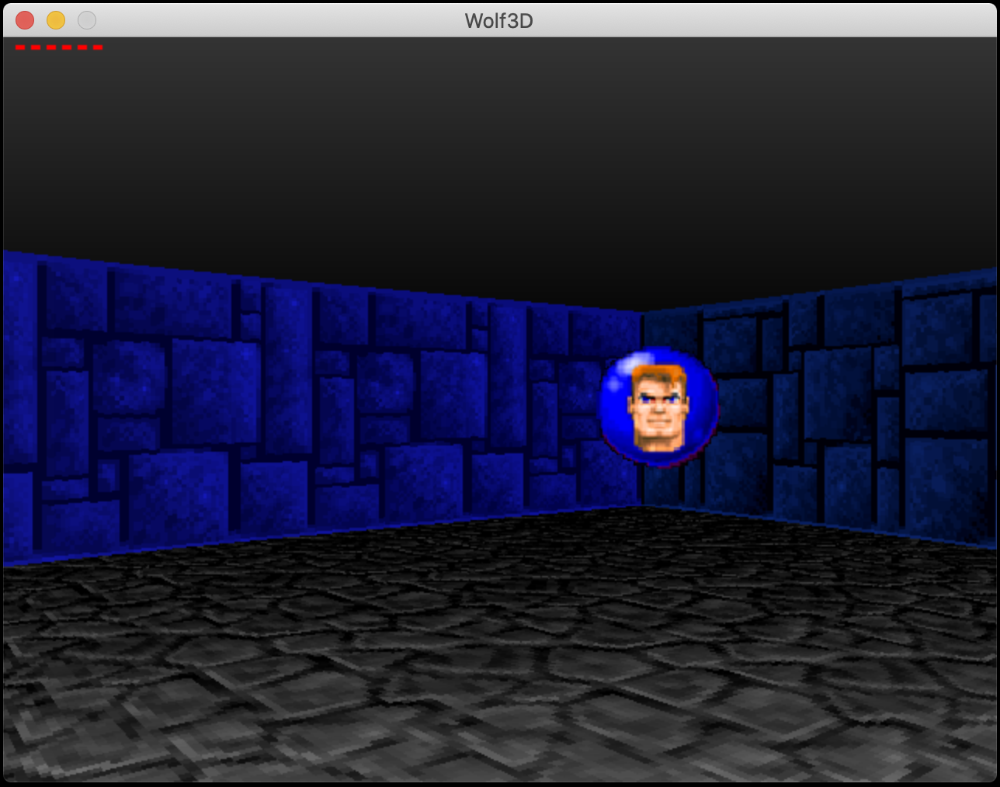
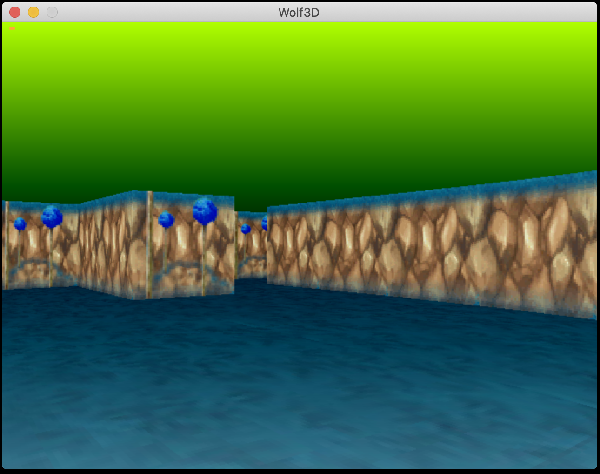
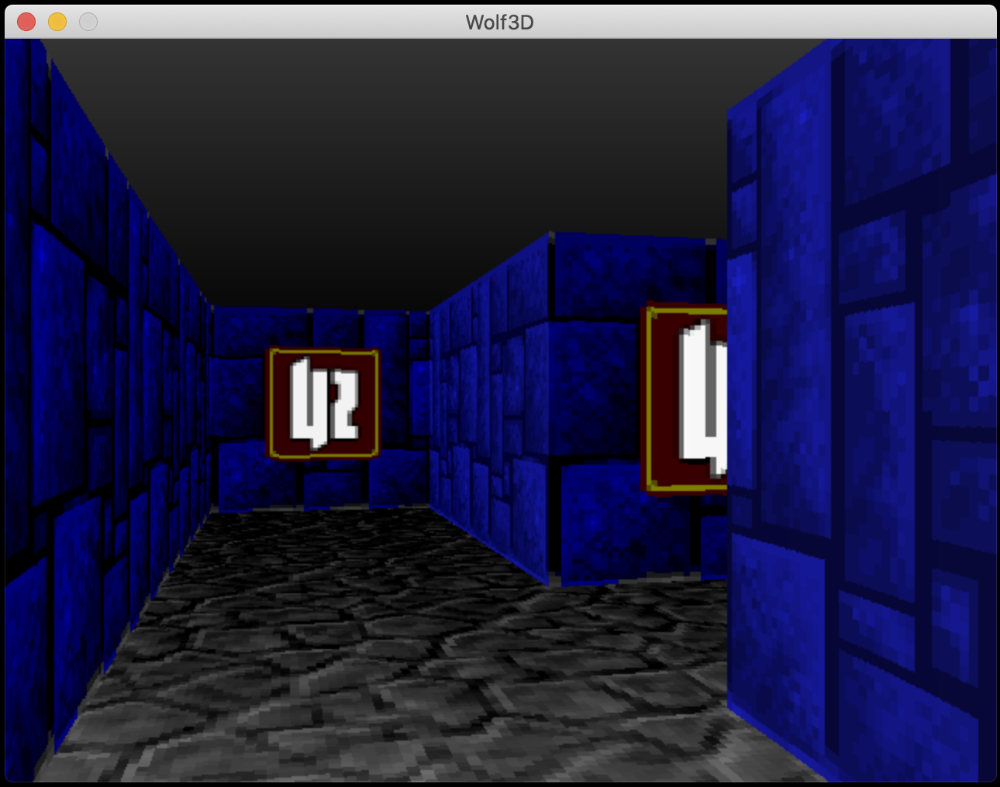
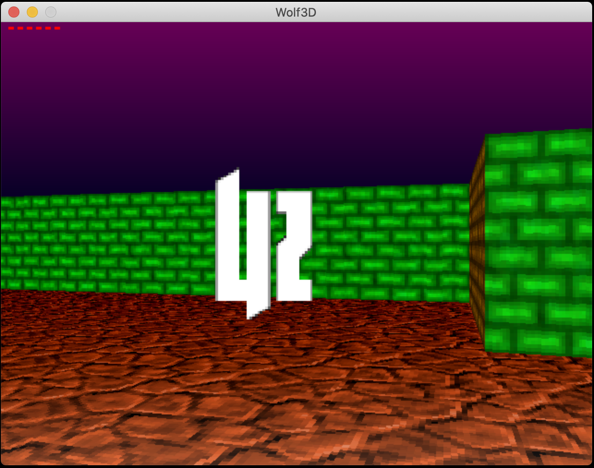
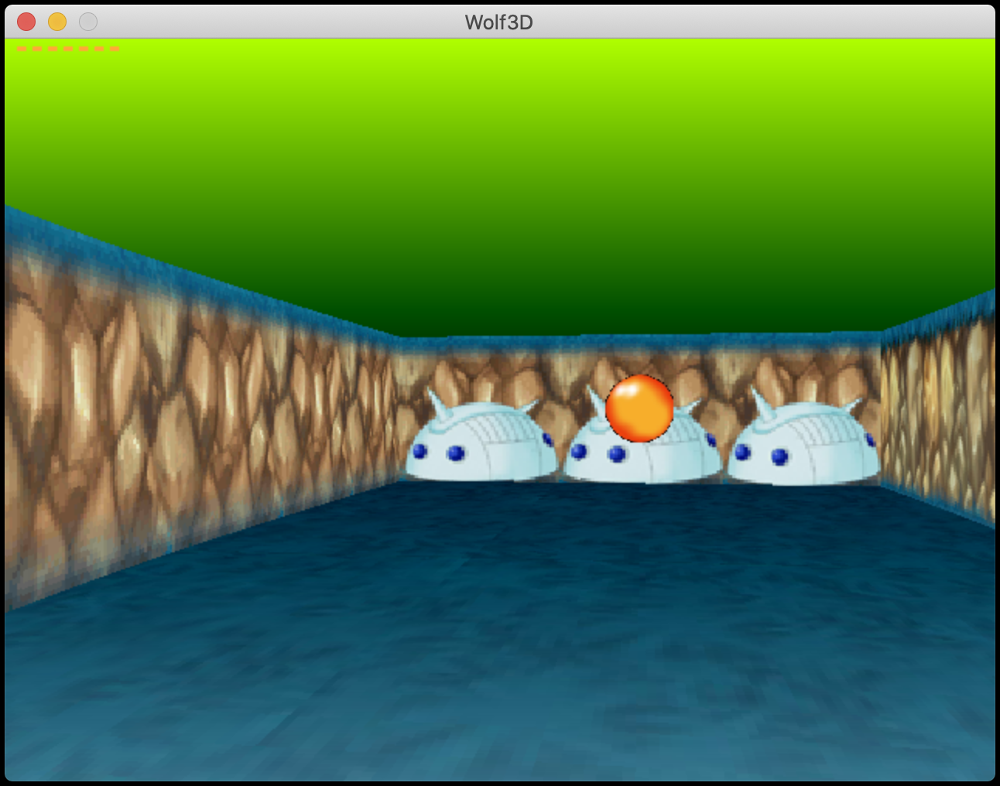
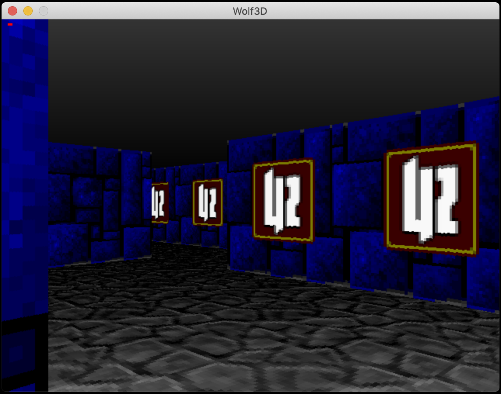

# Wolf3D

This project’s goal is to follow the footsteps of the brilliant programmer John Carmack to write our personal version of Wolfenstein 3D.
The objective is not to re-write the entire Wolfenstein 3D, but a 3D representation of a maze in which a player can find his way using the ray casting technique.

__NOTE:__
The whole project was realized using the graphic library: SDL2.
Only basic drawing functions of the library are authorized : open a window, lit a pixel and manage events.
Everything else has to be coded by students (ex. pixel coloring, map reader, rotations, vector library...).

Users can customize the maze through a colored map like this (the format is chosen by students)

__Mandatory options:__
- Size and the shape of the labyrinth editable via file
- ESC key and red cross on the Window quit the program cleanly
- Movements with arrow keys like the original game
- Various wall textures depending of compass point (North, South, East, West).

__Bonus options:__
- Wall collisions
- Floor texture
- Sky (Color Gradient)
- Distance fog
- Items in the maze
- Collectables items

  

Instructions:
- The project can be compiled on Linux and MacOS systems
- Open a terminal in the project root and compile the program with the command "make"
- Usage: ./wolf3d [map] /[texturepack]
- (The package "xorg-dev" is required to ensure the SDL operations)

_For this project I decided to make all files public but please do not hesitate to contact me if need additional details._
